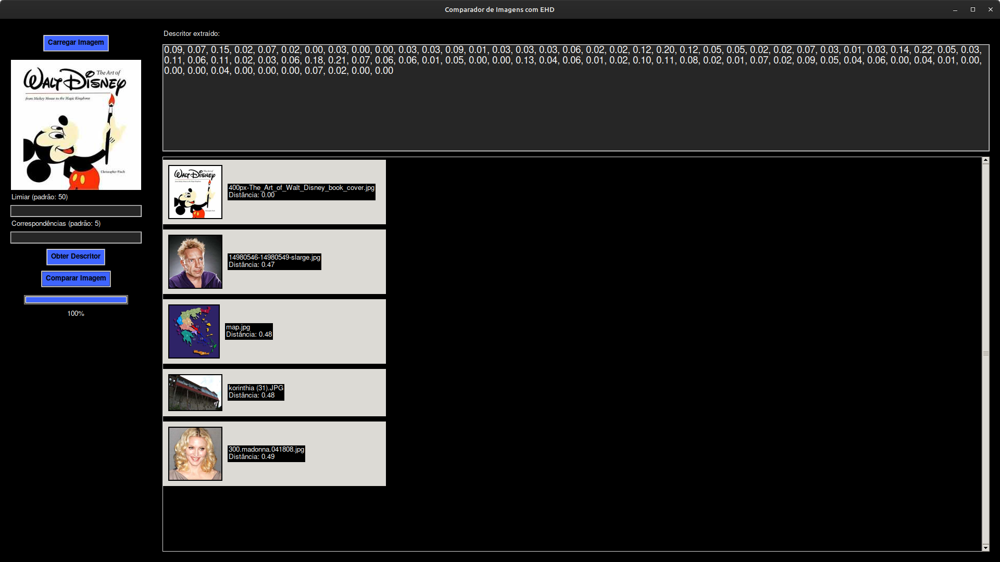

# 📷 visual_descrip

Python application developed for extracting and using MPEG-7 visual descriptors, specifically the **Edge Histogram Descriptor (EHD)**, with the goal of identifying the images most similar to a query image within a dataset.

---

## 🎯 Objective

The project allows to:

- Compute the EHD descriptor of an image based on the MPEG-7 standard.
- Compare the descriptor of the input image with those of other images in a directory.
- Identify and display the most similar images based on the **Euclidean distance** between descriptor vectors.

---

## 🧩 Project Structure

- `ehd.py`: Implementation of the **Edge Histogram Descriptor (EHD)** with quantization, normalization, and extraction according to the MPEG-7 standard.
- `matcher.py`: Responsible for comparing the input image descriptor with descriptors from a dataset, using Euclidean distance.
- `interface.py`: Graphical interface built with **Tkinter**, allowing image loading, parameter configuration, and viewing comparison results.

---

## 🖥️ Graphical Interface



The interface allows users to:

- Load a query image.
- Set the **edge threshold** and the number of similar images to return.
- Display the extracted descriptor vector.
- Start the comparison with the image directory.
- View results with thumbnails and calculated distances.
- Track progress with a loading bar.

---

## 🛠️ Requirements

- Python 3.x

### Required libraries:

- `numpy`
- `Pillow`
- `tkinter` (included by default in Python)
- `os`

Install requirements with:

```bash
pip install numpy pillow
```

---

## 🚀 How to Run

Clone the repository:

```bash
git clone https://github.com/carlosthassius/visual_descrip.git
cd visual_descrip
```

Run the interface:

```bash
python interface.py
```

Use the interface to:

- Load the query image.
- Set threshold and desired number of results.
- View similar images from the dataset.

---

## 🗂️ Directory Organization

- Make sure dataset images are in a local folder specified in the code (default: `Image_Dataset/`).
- Dataset image descriptors are **preprocessed** on the first run to speed up future comparisons.

---

## 🧪 Usage Example

1. Load the main image.
2. Adjust the threshold or keep the default (`50`).
3. Click **"Compare"**.
4. See results ordered by similarity.

---

## 📌 Notes

- The algorithm follows the **MPEG-7** standard for the EHD descriptor, with **5 directions** and **16 blocks**, totaling **80 bins**.
- The calculation is done on the image converted to grayscale based on **perceptual luminance**.
- Descriptors are quantized into **8 levels**, following the MPEG-7 standard table.

---

## 📈 Future Improvements

- Support for other descriptors (e.g., color, shape).
- Support for comparison with multiple directories.
- Optimization of loading and comparison times.
- Web version with responsive interface.

---

## 📄 License

This is an **academic** project developed within the scope of the **Audiovisual Processing** course at the Department of Electrical and Computer Engineering - **University of Coimbra**.
